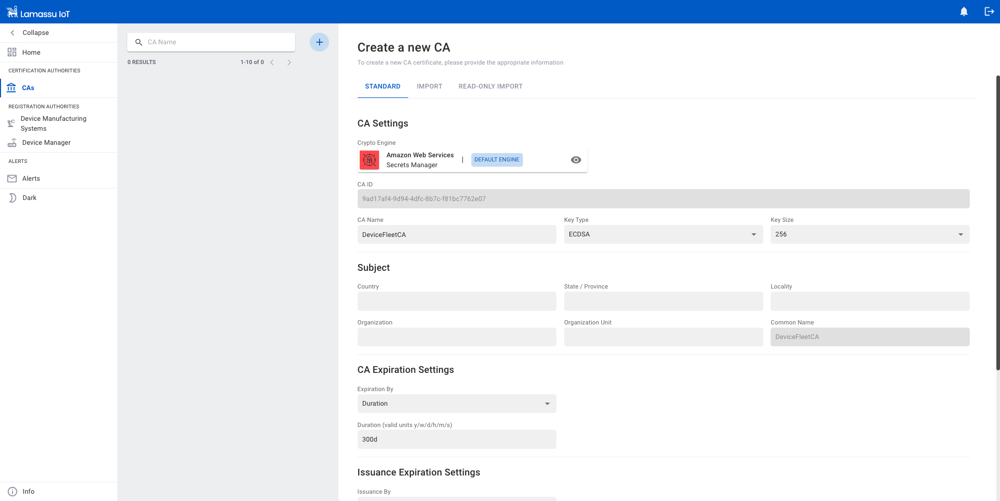
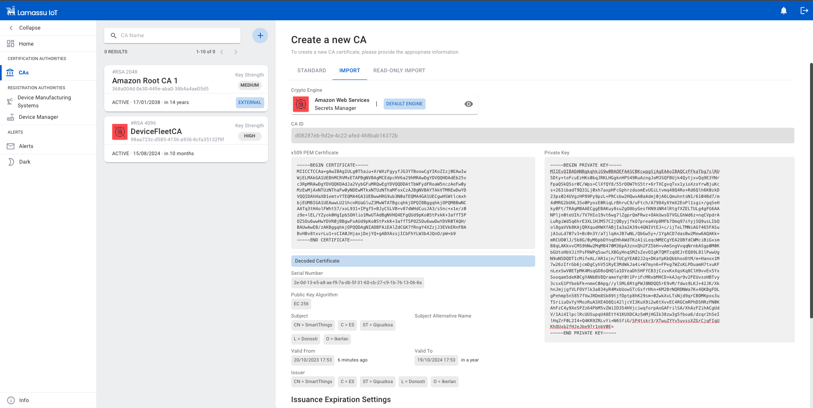
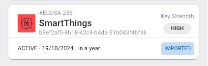
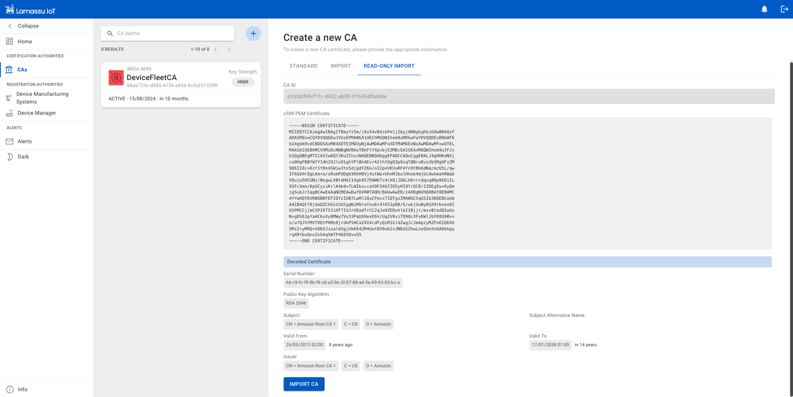
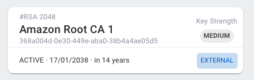

# CA Service

This section will guide you through the basic functionalities provided by our PKI to start provisioning your devices.

The first step to provision devices with digital certificates is to create the Certification Authority. The role of a CA is to issue and manage all the certificates.

## Create CA

There are three possibilities to create a new CA:

  - Create a new CA from scratch
  - Bring your own external CA
  - Import third-party external CA

### Create CA from Scratch

To create a new CA, fill the form taking into account the following considerations:

  **CA Settings**:

  - Lamassu supports the use of several cryptographic engines, therefore, when creating the CA you can choose which cryptographic engine to use to store the private key.

  - Lamassu supports both `RSA` and `EC` based CAs. But the configured Crypto Engine may or may not support both algorithms. Check out also the supported key sizes for each algorithm family as it is also dependant on the configured engine.

  **CA Expiration Settings** and **Issuance Expiration Settings**:

  - The CA expiration time must be greater than the lifespan of the issued certs.
  - There are 3 types of expiration formats, choose one:

    - `Duration`: Uses a relative *time delta* to determine the expiration date. The time delta can be specified in seconds (s), minutes (m), hours (h), days (d), weeks (w) or in years (y). Example: `10y` equals to 10 years.
    - `End Date`: Set a specific date for expiration in ISO 8601 format.
    - `Indefinite Validity`: The expiration is fixed to the following timestamp `99991231235959Z` (31/12/9999 at 23:59:59).

  - Subject properties are optional




### Bring your own external CA

To import an external CA, fill the form with the following considerations:

  **CA Settings**:

  - The configured Crypto Engine may or may not support importing external CAs.
  - Select the corresponding crypto engine
  - Import x509 PEM Certificate and Private Key in PEM Format

  **Issuance Expiration Settings**:

  - The CA expiration time must be greater than the lifespan of the issued certs.
  - `Duration`: Uses a relative *time delta* to determine the expiration date.

!!! note

    One simple way of testing this mechanism is by generating a CA using OpenSSL and then import it to Lamassu:

    ```bash
    openssl ecparam -genkey -name prime256v1 -out ca.key
    openssl req -new -x509 -key ca.key -out ca.crt -days 365
    ```





### Import third-party external CA

To import an third-party external CA, fill the form with the following considerations:

  **CA Settings**:
  - Import x509 PEM Certificate





## Monitoring System

The CA Service has a built-in CRON-like system that monitors all issued certificates based on the expiration date on each certificate. By default when deploying a Lamassu instance, the monitoring system is configured to be executed daily (CRON expression `0 0 * * *`)

As such, there are two kind of checks based on the expiration date:

**Default check**: Lamassu performs simple checks to identify `ACTIVE` certificates that have expired. If it finds any, it will update the certificate state to `EXPIRED` and trigger the `ca.certificate.update.status` cloud event.

**Custom checks**: You can also define your own set of custom checks to be notified each time a certificate expiration would expire prior to a custom time delta. This is really helpful for building complex automation processes. For instance, each time a device enrolls itself, Lamassu will automatically add two custom checks (Note that the delta times can be adjusted):

  - Preventive Check: At 31 days prior to its expiration.
  - Critical Check at 7 days prior to its expiration.

Once the CRON system finds that the Custom check threshold is met, it updates de certificate metadata indicating that the check monitoring criteria has been met. After that, the CA service will publish a new cloud event of type `ca.certificate.update.metadata`

In order to add a new custom check, update a Certificate `metadata` field as below:

```json
{
  "metadata":{
    "lamassu.io/ca/expiration-deltas": [
      {
        "name": "Preventive",
        "delta": "31d",
        "triggered": true,
      },
      {
        "name": "Critical",
        "delta": "7d",
        "triggered": false,
      }
    ]
  }
}
```