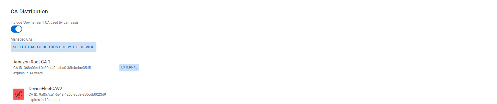

# DMS Service

## Basic Settings

**DMS Name**

This name refers to the DMS ID. This value is also used to construct the enrollment endpoint. It is highly recommended not to use names with white spaces.

**Deployment Mode**

Previous Lamassu versions would include two different deployment modes. The first developed mode was referred as the `On Premise` mode where a local Software was required to be developed and deployed outside Lamassu. This mode has been deprecated as the same functionality can be achieved with Lamassu's APIs. 

The second mode is referred as `Hosted by Lamassu` where no software has to be developed nor locally deployed. This mode allows configuring a Registration Authority based on an enrollment protocol. Once a DMS is created with this mode enabled, it will then enable the required endpoints for the selected enrollment standard.  

## Device Registration Settings

Each DMS defines how and when each device is registered within Lamassu. Check out the different configuration properties:

**Registration mode**

There are two registration modes to be enforced during the enrollment procedure. Either is done in a dynamic fashion, meaning that Lamassu does not check if the device was previously registered, or if in the other hand, there is a whitelisting approach to limit who can request a certificate:

-  `JITP` defines a dynamic registration approach. If during the enrollment process Lamassu detects that the requesting device does not exist, it then will **automatically** register it within the Device Manager Service using the DMSs Device Registration Settings such as the Icon or Tags.

- `Enforce Pre Registration` refers to the whitelisting approach. In contrast with the JITP method, this mode checks if a device exists. If no registration is found, it then will reject any enrollment request. Bare in mind that in order to have a valid registration, the requesting Device **MUST be assigned to the DMS being used to enroll**

**Icon**

Select the Icon and color to easily identify devices belonging to this DMS.

**Tags**

While registering devices, it is also possible assigning them a set of string tags that can be later used while finding a device or set of devices

## Enrollment Settings

**Protocol**

Each DMS can ONLY support ONE enrollment protocol. As of this time, there is also one enrollment protocol, the [Enrollment over Secure Transport](https://datatracker.ietf.org/doc/html/rfc7030) or EST protocol. There are plans of extending this list to include the [Lightweight Certificate Management Protocol (CMP) Profile](https://datatracker.ietf.org/doc/html/draft-ietf-lamps-lightweight-cmp-profile) once it is fully standardized.

**Authentication Mode**

One of the first checks the DMS performs during the enrollment process, is to check the authenticity of the incoming request. For such effects, Lamassu allows defining how this authentication procedure is performed. 

As of this time, there is only authentication method `Mutual TLS` witch enforces the device (or the requestor) to present Client Certificates during the TLS Handshake. If no certificates are presented. The enrollment request will fail with `401 Unauthorized` HTTP status code. If Client Certificates are in fact sent by the device, then the enrollment service will check if such certificates are authorized. Refer to the **Validation CAs** section to understand how the authorization mechanism is performed.

There are plans for introducing more authentication methods such as the `No Auth` method for testing purposes.

**Enrollment CA**

If all validation checks are successfully passed, then its time for the DMS to request the CSR signature to the CA service. The Enrollment CA property defines with witch CA should the CSR be signed. Only ONE CA can be specified.

**Validation CAs**

When a device (or any client) sends and enrollment request while sending Client Certificates, the DMS service will validate that in fact those certificates are authorized to perform such enrollment. Specifying a list of Certificate Authorities that authorize the enrollment request. At least ONE CA must be selected. 

Future versions will improve the validation process by using SKID and AKID if present in the Client Certificate. As of now, a basic "first-match" cryptographic approach is performed. 

**Allow Override Enrollment**

One key property to define is wether to allow enrollment requests of already enrolled devices. If this is set to `false` (set by default), any incoming requests can only be performed by devices that are in the `REQUIRES_PROVISIONING` state. If the device was previously enrolled, any new enrollment attempts will be blocked.

If set to `true`, the DMS will allow overriding the device by erasing the previous enrollment if a new **VALID** enrollment attempt is performed.

**Chain Validation Level**

This property allows specifying up to witch chain level should the DMS check for a valid Client Certificate. This value is set to `-1` to indicate that all the presented Client Certificates should be validated. If a value greater than > 0 is provided, the DMS will try Validating (using the configured Validation CAs) the presented Chain up to the specified level. 

## ReEnrollment Settings

**Allow Expired Renewal**

Specifying if devices that where previously enrolled by the DMS should be allowed to renew their certificate if they present an Expired Certificate. 

Future versions will allow defining a maximum expiration delta. As of now, the maximum expiration delta is set to indefinite meaning that if a device can present an expired by any number of days.

**Additional Validation CAs**

By default a device wishing to ReEnroll must present a certificate signed by the Enrollment CA. It is also possible defining an additional list of CA Certificates to be used to validate the ReEnrollment request in case the main validation between the Enrollment CA and the presented Client Certificate fails. This list can be empty but it comes handy while rotating the Enrollment CA.

## CA Distribution Settings

**Include 'Downstream' CA used by Lamassu**

Instruct whether to include the Certificate used to connect to Lamassu's Gateway (main access point for Lamassu's UI and all the APIs including the EST Service) into the DMS CA distribution list.

**Managed CAs**

List of Lamassu Managed CAs to include in the DMS DMS CA distribution list. Can select any type of CA (either `Managed`, `Imported`, or `External`)

## Additional Settings

### AWS IoT Connector