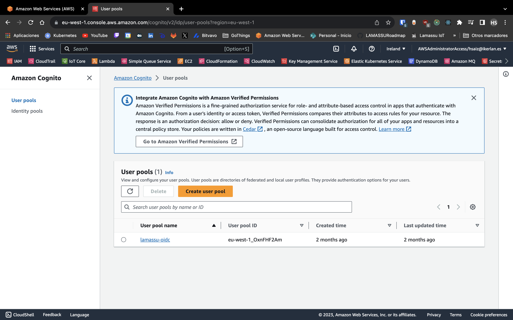

## Configuration

### Databases

Lamassu Core services have been designed in such a way to enable different storage engines. Each engine has its own set of pros and cons depending, and there is
no easy way of determining the best candidate. Each scenario is unique in terms of data volume, availability requirements or even pricing requirements in case
of delegating on any cloud provider.

#### Postgres

The main Database for the current Lamassu version is postgres. You can provide any Postgres DB instance such as a HA Postgres deployment, an AWS RDS DB with
postgres driver or similar alternatives. Note that each lamassu service expects it's own DB within the DB instance. As such, the deployed postgres instance must
include the following DBs: `alerts`, `ca`, `cloudproxy`, `devicemanager`, `dmsmanager`. Additionally if Keycloak is used as the authentication service, the DB
instance must also supply the `auth` DB.

The following Postgres Single-Node deployment configuration is only meant for testing purposes and should not be used in a production environment as it doesn't
follow best practices such as using unsafe password credentials

```yaml
cat > postgres.yaml << "EOF"
fullnameOverride: "postgresql"
global:
  postgresql:
    auth: #(1)
      username: admin
      password: admin
primary:
  initdb:
    scripts:
      init.sql: |
        CREATE DATABASE auth;
        CREATE DATABASE alerts;
        CREATE DATABASE ca;
        CREATE DATABASE devicemanager;
        CREATE DATABASE dmsmanager;
EOF
```

1.  Place here the admin credentials provided during PostgreSQL configuration.

```bash
helm repo add bitnami https://charts.bitnami.com/bitnami
helm install postgres bitnami/postgresql -f postgres.yaml
```

Lamassu's Helm chart allows specifying the connection parameters to be used by the different services by providing the following configuration in the
`values.yaml` file:

```yaml
postgres:
  hostname: "postgresql"
  port: 5432
  username: "admin" #(1)
  password: "admin"
```

1.  Customize your admin credentials here

#### CouchDB

TODO: Future versions will include support for CouchDB as the Storage Engine

#### AWS DynamoDB

TODO: Future versions will include support for DynamoDB as the Storage Engine

### Async Messaging

As of now, AMQP is the only Async Messaging engine supported. The Async Messaging engine service a crucial role for sending PKI related events in real time.
Check out all the events generated by Lamassu services in the [Cloud Events](/apis/cloud-events) section.

#### RabbitMQ

RabbitMQ is perhaps the most popular AMQP service, and its deployment for a test scenario is quite straight forward.

Start by deploying RabbitMQ with your own configuration. This section contains a basic configuration deployment and it should not be used in any production
environment as it is due to insecure configurations (like non robust credentials for instance):

```yaml
fullnameOverride: "rabbitmq"
auth: #(1)
  username: "user"
  password: "user"
```

1.  Place here the admin credentials provided during RabitMQ configuration.

```bash
helm repo add bitnami https://charts.bitnami.com/bitnami
helm install rabbitmq bitnami/rabbitmq -f rabbitmq.yaml
```

Lamassu's Helm chart allows specifying the connection parameters to be used by the different services by providing the following configuration in the
`values.yaml` file:

```yaml
amqp:
  hostname: "rabbitmq"
  port: 5672
  username: "user" #(1)
  password: "user"
  tls: false
```

1.  Customize your admin credentials here


### Authentication

#### Keycloak

Keycloak is an open-source identity and access management (IAM) solution developed by Red Hat. It provides a set of features and capabilities to handle user
authentication, authorization, and identity management in web and mobile applications.

As of now, lamassu integrates this component while deploying Lamassu's own helm chart. By default it is deployed on all instances, but can be disabled if
another OIDC based provider is configured.

To disable keycloak in a lamassu installation, provide the following `values.yaml` file containing:

```yaml
services:
  keycloack:
    enabled: false
```

If instead you choose to go with the default installation and use Keycloak as your IAM OIDC-based provider, include the following section in your `values.yaml`
file:

```yaml
services:
  keycloack:
    enabled: true
    image: ghcr.io/lamassuiot/keycloak:2.1.0
    adminCreds: # (1)
      username: "<admin-user>"
      password: "<admin-password>"
```

1. Set here the credentials of the root admin user for the Keycloak instalation.

The Keycloak Admin user credentials to be created should be specified in this section. This user is required to create Lamassu IoT users after installation by
following the steps below:

1. **Log in to the Keycloak Administration Console**: Open your web browser and navigate to the Keycloak Administration Console at
    `https://<lamasu-domain>/auth/admin`. Log in with your administrator credentials. These credentials has been provided during the helm chart configuration.

1. **Select the "lamassu" Realm**: After logging in, use the dropdown menu in the top left corner to select the `lamassu` realm. This will take you to the realm
    where you want to create the user.

1. **Navigate to the "Users" Section**: In the left-hand sidebar, locate and click on the "Users" option. Here, you'll see a list of existing users in the
    `lamassu` realm.

1. **Create a New User**: To create a new user, click the "Add User" button. This will open a form where you can configure the details of the new user.

1. **Configure User Details**: In the user creation form, provide information such as the username, full name, email. Click on the create button.

1. **Set User Credentials**: In the "Credentials" tab, set the user's password.

1. **Assign the "pki-admin" Role**: To assign the `pki-admin` role to the user, go to the "Role Mappings" tab. Click on "Assing role", find and select
    the "pki-admin" role and move it to the "Assigned Roles" list. This will grant the user the `pki-admin` role.

1. **Login with the new user**: Once you've configured the user navigate to the Lamassu IoT console URL `https://<lamasu-domain>` and provide the user credentials.

The new user is now created and has been assigned the `pki-admin` role in the `lamassu` realm. Ensure that the user has the appropriate roles and permissions as
per your security and access requirements.

#### AWS Cognito

Amazon Cognito is a fully managed identity and user management service provided by AWS that simplifies the process of adding user sign-up, sign-in, and
authentication to web and mobile applications. It is a comprehensive identity and access management (IAM) solution that is designed to help developers secure
their applications by handling the user management and authentication aspects.

Start by creating going to AWS Console and create a new Cognito user pool in case you don't already have one. As can be seen in the image below, in this case
the user pool has been named lamassu-oidc.



!!! info "Lamassu Helm Chart"
    Make sure to copy the **user pool ID** assigned by AWS as it will be needed while configuring the Lamassu's Helm Chart. Note that the user pool ID is
    different than the assigned name.

Cognito provides a mechanism that assigns a *friendly* URL when a user is redirected to cognito to sign in. Go to `App Integration > Domain > Actions` and
select `Create Cognito Domain` and provide a valid name. Note that the name must be unique within the same AWS region.


Optionally, it is possible to customize the sign in page with some custom CSS and a logo image. To do so, go to `App Integration > Hosted UI customization` For
instance you can configure Cognito to use the following [Image (click to open)](imgs/hosted-ui-logo.jpeg) as the main logo displayed when a user is redirected
to sign in.

To instruct Cognito to display the main logo, use the following css:

```css
.logo-customizable {
  max-width: 100%;
  max-height: 100%;
}

.banner-customizable {
  padding: 10px 0px 10px 0px;
  background-color: #007ACC;
}

.submitButton-customizable {
  font-size: 14px;
  font-weight: bold;
  margin: 20px 0px 10px 0px;
  height: 40px;
  width: 100%;
  color: #fff;
  background-color: #007ACC;
}

.submitButton-customizable:hover {
  color: #fff;
  background-color: gray;
}

```

Finally, and the most important part, is creating a new client application for lamassu within the user pool. Go to `App Integration > App clients and analytics`
and create a new Client and configure as follows:

- App Client
    - App type: Select **Public Client**
    - App client name: Specify a friendly name for the app client. i.e.: `lamassu-ui`
- Hosted UI settings
    - Allowed callback URLs: This is a key parameter. Bare in mind the **URL** used to access lamassu's UI. If you access the UI at `https://dev.lamassu.io` then
        configure such url to be allowed to sign in
    - Allowed sign-out URLs: Use the same URL as the allowed callback URL but appending `/loggedout` at the end. i.e.: `https://dev.lamassu.io/loggedout`

!!! info "Lamassu Helm Chart - `services.auth.oidc.clientId`"
    Make sure to copy the App Client ID assigned by AWS as it will be needed while configuring the Lamassu's Helm Chart. Note that the App Client ID is
    different than the assigned name.

The last critical part for configuring Cognito is to define different user groups to limit what each user is allowed to do with lamassu. As of now, lamassu only
has two roles: `admin` and `operator`. In this example, we will group our user pool users in two cognito groups:

- `pki-admin` group: the users that are assigned to this cognito group will have FULL access to all operations within Lamassu, so make sure to only assign
    authorized users.
- `audit` group: in contrast, this second group will have limited access.

Create and assign the users within your cognito user pool under the `Groups` tab

!!! info "Lamassu Helm Chart"
    Note that we will map those groups into actual lamassu roles later on while configuring the helm chart under `services.auth.authorization`

Configure Lamassu helm chart with the following section. Make sure to replace:

- `COGNIT_AWS_REGION`
- `COGNITO_HOSTED_UI_URL`
- `COGNITO_USER_POOL_ID`
- `COGNITO_CLIENT_ID`

As well as map the appropriate cognito groups under `services.auth.authorization`

```yaml
services:
  keycloack:
    enabled: false
auth:
  oidc:
    frontend:
      authority: https://cognito-idp.<COGNIT_AWS_REGION>.amazonaws.com/<COGNITO_USER_POOL_ID>
      clientId: <COGNITO_CLIENT_ID>
      awsCognito:
        enabled: true
        hostedUiDomain: "<COGNITO_HOSTED_UI_URL>"
  apiGateway:
    jwksUrl: https://cognito-idp.<COGNIT_AWS_REGION>.amazonaws.com/<COGNITO_USER_POOL_ID>/.well-known/jwks.json
  authorization:
    rolesClaim: "cognito:groups"
    roles:
      admin: pki-admin
      operator: audit
```
