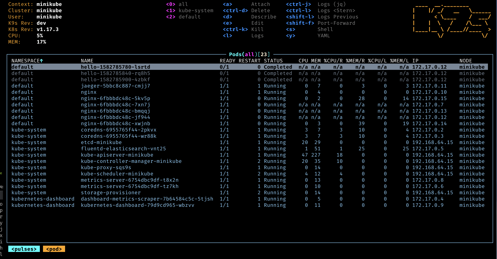

# Installing Kubernetes on K3s

## K3s

Yo can use K3s Kubernetes distribution as Kubernetes infraestructure for Lamassu. Please, follow the installation steps described in the K3s
documentation [https://docs.k3s.io/quick-start](https://docs.k3s.io/quick-start) to get a K3s instance up and running.

### Install K3s

```bash
curl -sfL https://get.k3s.io | INSTALL_K3S_CHANNEL=v1.26 INSTALL_K3S_EXEC="--disable traefik" K3S_KUBECONFIG_MODE="644" sh -s -
mkdir .kube
cat /etc/rancher/k3s/k3s.yaml > .kube/config
```

### Install helm

```
curl -fsSL -o get_helm.sh https://raw.githubusercontent.com/helm/helm/main/scripts/get-helm-3
chmod 700 get_helm.sh
./get_helm.sh
```

### Install Nginx Ingress controller

```bash
kubectl apply -f https://raw.githubusercontent.com/kubernetes/ingress-nginx/controller-v1.8.2/deploy/static/provider/baremetal/deploy.yaml
```

### Install Cert Manager

```bash
kubectl apply -f https://github.com/cert-manager/cert-manager/releases/download/v1.14.0/cert-manager.yaml
```

## K9s

We recommend installing K9s, a terminal based client application, as it comes handy while debugging any kubernetes related resource,
including watching pod/container logs, deleting pods, scaling replicas and much more: [https://k9scli.io/topics/install/](https://k9scli.io/topics/install/)

