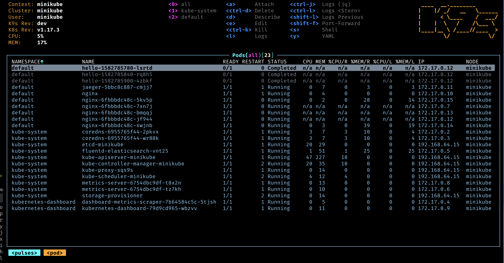

# Installing Kubernetes on MicroK8s

## MicroK8S

We recommend installing microk8s on top of any Ubuntu distribution as it is well maintained by the ubuntu community. Other distributions may also be supported.

Start by downloading kubernetes from microk8s official site: [https://microk8s.io/docs/getting-started](https://microk8s.io/docs/getting-started)

Once you have a running instance, make sure to enable the required plugins:

- **StorageClass**: Enable a basic storage class provider by enabling the plugin

    ```bash
    microk8s enable hostpath-storage
    ```

- **CoreDNS**: This service is not provisioned by default. Run the following command to enable it

    ```bash
    microk8s enable dns
    ```

- **Ingress Controller**:  This distribution has an easy way of installing this plugin by running:

    ```bash
    microk8s enable ingress
    ```

    Once the ingress controller is installed, apply this patch to allow mutual TLS connections to go through the nginx controller

    ```bash
    microk8s kubectl -n ingress patch ds nginx-ingress-microk8s-controller \
         --type=json \
         -p='[{"op": "add", "path": "/spec/template/spec/containers/0/args/-", "value": "--enable-ssl-passthrough"}]' \
        /
    ```

- **CertManager**: To enable the plugin run:

    ```bash
    microk8s enable cert-manager
    ```

MicroK8s embeds two main subcommands that will be used later on, it is recommended adding two aliases on the `kubectl` and `helm` subcommands as follows:

```bash
echo "alias kubectl='microk8s kubectl'" >> ~/.bash_aliases
echo "alias helm='microk8s helm'" >> ~/.bash_aliases
source ~/.bash_aliases
```

## K9s

We recommend installing K9s, a terminal based client application, as it comes handy while debugging any kubernetes related resource,
including watching pod/container logs, deleting pods, scaling replicas and much more: [https://k9scli.io/topics/install/](https://k9scli.io/topics/install/)


