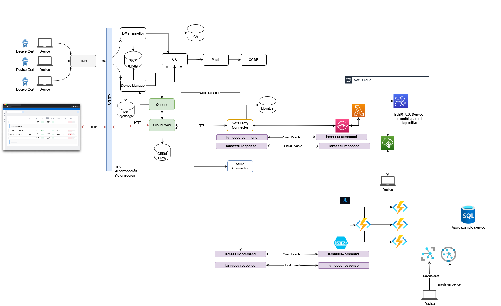

# Extending Lamassu

A PKI has three types of core compoents: `CAs`, `RAs` and `VAs`. Each PKI implementation must have an instance of those compoennts (at least) to be considered a mature digital identity provider.

* `Certificate authority (CA)` - Issues an entity's certificate and acts as a trusted component within a private PKI. Any certificate issued by the CA is trusted by all entities that trust the CA. The exact role of a CA will depend on its position within a CA hierarchy.

* `Registration authority (RA)` - Receives certificate signing requests and verifies the identity of an end entity. The RA will approve a request before the certificate can be issued by the CA. This is a very important stage of the process and it often involves a procedure to enrol end entities into the PKI.

* `Validation authority (VA)` - A VA allows an entity to check that a certificate has not been revoked. The VA role is often carried out by an online facility hosted by an organisation who operates the PKI. A validation authority will often use OCSP or CRL to advertise revoked certificates.


Lamassu is no stranger to those concepts. In fact, Lamassu goes one step further by implementing `LRAs` or Local Registration Authorities also named DMSs.

* `Local registration authority (LRA)` -  is an optional part of a public key infrastructure that maintains users' identities from which certification authorities can issue Digital Certificates.


Extending the PKI is a core principal for Lamassu. There are multiple ways to customize Lamassu to the required needs by just modifying one of the core components or by developing and adding new ones. This section will describe some decissions that have been addopted to provide an extensible PKI that is able to integrate with some cloud providers such as [AWS IoT Core](/docs/aws.md#aws-iot-core) or [Azure IoT Hub](/docs/azure.md#azure-iot-hub).




## The AMQP Queue

To get developers up to speed with new updates releated with Lamassu, a AMQP-based Queue service is deployed to provide real-time events. The core components (`Lamassu CA`, `Lamassu DeviceManager` and `Lamassu DMS Enroller`) publish new event messages if an update opperation is triggered. Update opperations are any tpye of function that end up modifying data in any way. Once a core component registers an update opperation, it then published a special crafted event message to the `lamassu_events` queue.


## Cloud Proxy
A proxy server acts as a gateway between the service and the internet, and verifies and forwards incoming client requests to other servers for further communication.

### AWS Services used by Lamassu

- [AWS Lambda](aws.md#aws-lambda)
- [AWS IoT Core](aws.md#aws-iot-core)
- [AWS SQS](aws.md#aws-sqs)
- [AWS Cloud Formation](aws.md#aws-cloud-formation)


### Azure Services used by Lamassu

- [Azure functions](azure.md#azure-functions)
- [Azure storage queue](azure.md#azure-queue-storage)
- [Azure Iot Hub](azure.md#azure-iot-hub)
- [Azure Iot Hub DPS](azure.md#azure-iot-hub-dps)


##  AWS Infraestructure Deployment


To deploy the structure in AWS to proper function with Lamassu, `AWS CDK` is used.
The AWS Cloud Development Kit (AWS CDK) is an open-source software development framework to define your cloud application resources using familiar programming languages.

### Directory layout

`/bin/lamassu-cdk.ts` app entry point. It creates objects of classes defined in /lib.

`/lib` it contains all the stacks for our project, were AWS resources are defined.

`cdk.json` file tells the CDK Toolkit how to execute your app.

### Prerequisites

Install nodejs 14.X, npm and jq.

```
sudo apt install jq nodejs npm
```

Install aws-cdk with npm:
```
npm install -g aws-cdk@1.x
```

Verify cdk is installed:
```
cdk --version
```

Install AWS cli and configure credentials:

1. Install AWS CLI: https://docs.aws.amazon.com/cli/latest/userguide/getting-started-install.html
2. Configure AWS CLI:
```
aws configure
```
Provide your AWS access key ID, secret access key, and default region when prompted. You can also configure `.aws/credentials` file in your home directory instead.


### Usage


> **NOTE**: As some AWS features used in this project are still not implemented in AWS CDK, some of the steps are done via CLI.


Go to cdk project home directory:

```
cd lamassu-cdk
```

**Option 1**: Execute deploy script:

```
bash deploy-lamassu.sh
```

**Option 2**: Execute it step by step:

```
npm i

npm i --prefix resources/sqsFilterLambda 

cdk deploy --outputs-file outputs.json
aws lambda update-event-source-mapping --uuid $(cat outputs.json | jq -r .LamassuCdkStack.EventSourceMappingUUID) --filter-criteria file://filter-criteria.json
```

Remove Lamassu resources:

```
cdk destroy LamassuCdkStack
```

### Useful commands

 * `npm run build`   compile typescript to js
 * `npm run watch`   watch for changes and compile
 * `npm run test`    perform the jest unit tests
 * `cdk deploy`      deploy this stack to your default AWS account/region
 * `cdk diff`        compare deployed stack with current state
 * `cdk synth`       emits the synthesized CloudFormation template


## AWS Cloud-Trail

When triggering an event of updating a certificate or a CA status, `AWS CloudTrail` will monitors and create records the activity.


| **Event Type**                                                          | **Source**                            | **Description** |
|-------------------------------------------------------------------------|---------------------------------------|-----------------|                      
| io.lamassu.iotcore.cert.status.update                                   | aws/cloud-trail                       |                 |
| io.lamassu.iotcore.ca.status.update                                     | aws/cloud-trail                       |                 |


## References

* AWS Docs on CDK: [AWS CDK](https://docs.aws.amazon.com/cdk/v2/guide/getting_started.html)
* API reference for AWS CDK: [API reference](https://docs.aws.amazon.com/cdk/api/v1/docs/aws-construct-library.html)
* Cloud Events SDK for Go: [Cloud Events SDK for GO](https://github.com/cloudevents/sdk-go)
* Gokit, building microservices in go: [(Gokit)](https://gokit.io/faq/)

