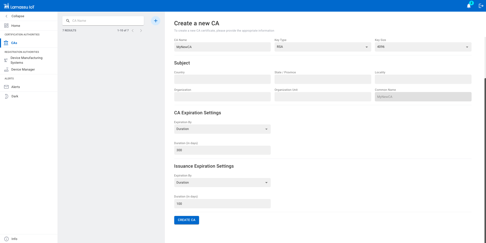

# PKI Admin Setup

Before jumping any further, please check out the [installation process](/setup)
to deploy all Lamassu services. This section will guide you through the basic
functionalities provided by our PKI to start provisioning your devices.

## Certification Authorities

The first step to provision your devices with digital certificates is to create
the Certification Authority. The role of a CA is to issue and manage all the
certificates.

There are three possibilities to create a new CA:
  - Create a new CA from scratch
  - Bring your own external CA
  - Import third-party external CA

### Create a new CA from scratch
=== "Web Console"

    To create a new CA, fill the form taking into account the following considerations:

      **CA Settings**:

      - Lamassu supports both `RSA` and `EC` based CAs. But the configured [Crypto Engine](crypto-engines.md) may or may not support both algorithms. Check out also the supported key sizes for each algorithm family as it is also dependant on the configured engine.
      - The CA name **MUST** be unique within the current Lamassu instance.

      **CA Expiration Settings** and **Issuance Expiration Settings**:

      - The CA expiration time must be greater than the lifespan of the issued certs.
      - There are 3 types of expiration formats, choose one:

        - `Duration`: Uses a relative *time delta* to determine the expiration date. As of now, the duration value **MUST be set in days**. Future versions will enable specifying duration in a string-like expression such as `100d` or `3y`.
        - `End Date`: Set a specific date for expiration.
        - `Indefinite Validity`: The expiration is fixed to the following timestamp `99991231235959Z` (31/12/9999 at 23:59:59).
    <figure markdown>
      
      <figcaption>Create CA from scratch</figcaption>
    </figure>

=== "API Rest"
    *TODO*

=== "Golang SDK"
    *TODO*

### Bring your own external CA

=== "Web Console"

    To import an external CA, fill the form with the following considerations:

      **CA Settings**:

      - The configured [Crypto Engine](crypto-engines.md) may or may not support importing external CAs.
      - The CA name **MUST** be unique.

      **CA Expiration Settings** and **Issuance Expiration Settings**:

      - The CA expiration time must be greater than the lifespan of the issued certs.
      - There are 3 types of expiration formats, choose one:
        - `Duration`: Uses a relative *time delta* to determine the expiration date.
        - `End Date`: Set a specific date for expiration.
        - `Indefinite Validity`: The expiration is fixed to the following timestamp `99991231235959Z` (31/12/9999 at 23:59:59).

=== "API Rest"
    *TODO*

=== "Golang SDK"
    *TODO*

### Import third-party external CA

