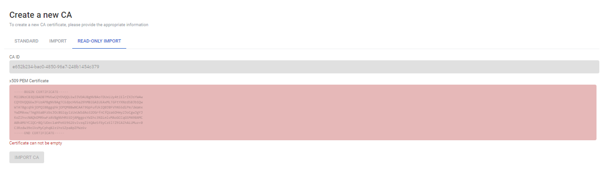
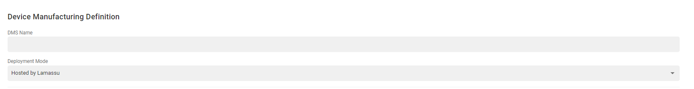
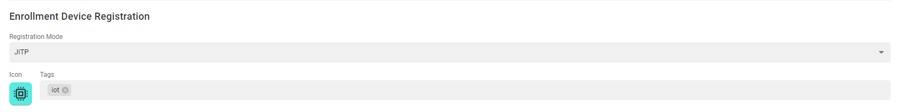
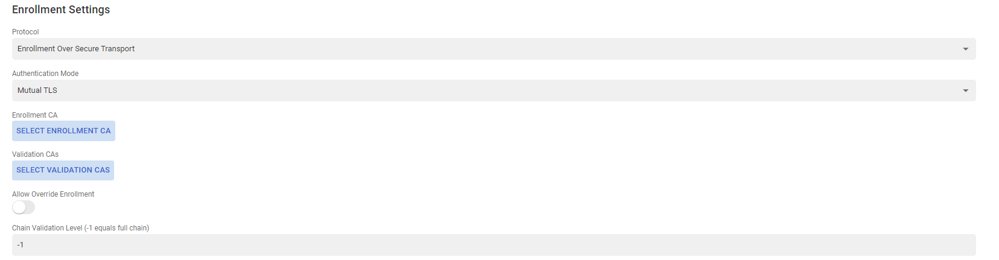
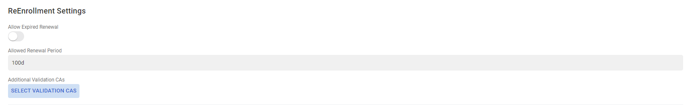
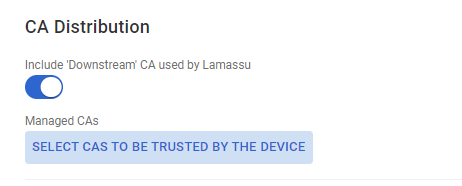

# PKI Admin Setup

Before jumping any further, please check out the [installation process](/setup)
to deploy all Lamassu services. This section will guide you through the basic
functionalities provided by our PKI to start provisioning your devices.

## Certification Authorities

The first step to provision your devices with digital certificates is to create
the Certification Authority. The role of a CA is to issue and manage all the
certificates.

There are three possibilities to create a new CA:
  - Create a new CA from scratch
  - Bring your own external CA
  - Import third-party external CA

### Create a new CA from scratch
=== "Web Console"

    To create a new CA, fill the form taking into account the following considerations:

      **CA Settings**:
      - Lamassu supports the use of several cryptographic engines, therefore, when creating the CA you can choose which cryptographic engine to use to store the private key.
      - Lamassu supports both `RSA` and `EC` based CAs. But the configured [Crypto Engine](crypto-engines.md) may or may not support both algorithms. Check out also the supported key sizes for each algorithm family as it is also dependant on the configured engine.
      - The CA name **MUST** be unique within the current Lamassu instance.

      **CA Expiration Settings** and **Issuance Expiration Settings**:

      - The CA expiration time must be greater than the lifespan of the issued certs.
      - There are 3 types of expiration formats, choose one:

        - `Duration`: Uses a relative *time delta* to determine the expiration date. As of now, the duration value **MUST be set in days**. Future versions will enable specifying duration in a string-like expression such as `100d` or `3y`.
        - `End Date`: Set a specific date for expiration.
        - `Indefinite Validity`: The expiration is fixed to the following timestamp `99991231235959Z` (31/12/9999 at 23:59:59).
    <figure markdown>
      
      <figcaption>Create CA from scratch</figcaption>
    </figure>

=== "API Rest"
    *TODO*

=== "Golang SDK"
    *TODO*

### Bring your own external CA

=== "Web Console"

    To import an external CA, fill the form with the following considerations:

      **CA Settings**:

      - The configured [Crypto Engine](crypto-engines.md) may or may not support importing external CAs.
      - Select the corresponding crypto engine
      - The CA name **MUST** be unique.
      - Import x509 PEM Certificate and Private Key in PEM Format

      **Issuance Expiration Settings**:
      - The CA expiration time must be greater than the lifespan of the issued certs.
      - `Duration`: Uses a relative *time delta* to determine the expiration date.
    <figure markdown>
      
      <figcaption>Import CA from scratch</figcaption>
    </figure>
=== "API Rest"
    *TODO*

=== "Golang SDK"
    *TODO*

### Import third-party external CA

=== "Web Console"

    To import an third-party external CA, fill the form with the following considerations:

      **CA Settings**:
      - The CA name **MUST** be unique.
      - Import x509 PEM Certificate

    <figure markdown>
      
      <figcaption>Import third-party CA from scratch</figcaption>
    </figure>
=== "API Rest"
    *TODO*

=== "Golang SDK"
    *TODO*

### Device Manufacturing Systems

The second step before provisioning the devices is to create a DMS. The DMS is responsible for issuing and managing digital certificates.

=== "Web Console"

    To create a DMS, I filled in the form with the following considerations:

      **DMS Definition**:

      - The DMS name **MUST** be unique.
      - Deployment Mode **MUST** be Hosted by Lamassu
    <figure markdown>
      
      <figcaption>DMS Definition</figcaption>
    </figure>

      **Enroll Device Registration**:

      - Registration Mode can be of two types:
        - JITP: All devices are provisioned, i.e. those that are registered and those that are not.
        - Enforce Pre Registration: Only pre-registered devices are provisioned.
      - Choose the Icon the device is to have
      - Tags associated with the device
    <figure markdown>
      
      <figcaption>Enroll Device Registration</figcaption>
    </figure>

      **Enrollment Settings**:

      - The protocol used for the enrolment process is EST and the authentication is MutualTLS.
      - Select the CA through which the certificates are to be issued
      - Select the validation CAs to authorise device enrolment.
      - In case you want to enroll devices that are already provisioned, select the **Allow Override Enrollment** variable.
      - The **Chain Validation Level** is explained in the [provisioning flows](usage-flows.md) section.
    <figure markdown>
      
      <figcaption>Enrollment Settings</figcaption>
    </figure>

      **Reenrollment Settings**:

      - If you want to allow the reenrollment of devices with expired certificate, you have to activate the flag **Allow Expired Renewal**.
      - Configure the period from which certificate renewal is to be allowed
      - Select additional CAs to validate/authorise device reenrollment.
    <figure markdown>
      
      <figcaption>Reenrollment Settings</figcaption>
    </figure>

      **CA distribution**:

      - Select the certificates of the CAs to be sent via the CACerts endpoint.
    <figure markdown>
      
      <figcaption>CA distribution</figcaption>
    </figure>

      **AWS IoT Settings**:

      - Select the type of shadow to be created on the device, **Classic Shadow** or **Named Shadow**.
    <figure markdown>
      
      <figcaption>AWS IoT Settings</figcaption>
    </figure>

=== "API Rest"
    *TODO*

=== "Golang SDK"
    *TODO*