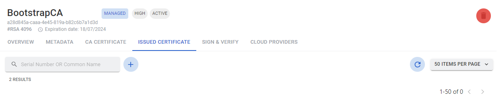

# Device Integration

## Core Operations

### Obtain the first certificate

!!! warning
    One common source of problems while integrating devices with Lamassu comes during the TLS-Handshake process between the PKI and the device.

    ``` mermaid
    graph LR
      A[Device] --> B[Proxies: i.e. AWS NLB];
      B --> C[Kubernetes Nginx Ingress Controller];
      C --> D[Lamassu API GW];
      D --> E[DMS Manager];
      style B fill:#ddd,stroke:#333,stroke-width:1px
      style C fill:#ddd,stroke:#333,stroke-width:1px
    ```


    `SNI` is required during the TLS-Handshake by `Kubernetes Nginx Ingress Controller` to be able to route traffic to `Lamassu API GW`. Otherwise Lamassu won't get an *intact* Mutual TLS connection, witch implies that Lamassu will receive an HTTP request without the proper device certificate resulting in an invalid enrollment.

1. Obtain the Bootstrap certificate signed by the validation CA configured in the creation of the DMS
2. Perform device enrollment using the EST protocol and the URL https://dev.lamassu.io/api/dmsmanager/.well-known/est/{dms_name}/simpleenroll
=== "Web Console"

    - In the **ISSUED CERTIFICATE** screen of the validation CA, click on the icon "plus".
    <figure markdown>
      
      <figcaption>Issued certificate</figcaption>
    </figure>

    - Generate or Import the CSR.
    <figure markdown>
      
      <figcaption>Generate CSR</figcaption>
    </figure>

    - Generate the certificate
    <figure markdown>
      
      <figcaption>Generate Certificate</figcaption>
    </figure>

=== "API Rest"
    *TODO*

=== "Golang SDK"
    *TODO*


### Renew certificates

Perform device reenrollment using the EST protocol and the URL https://dev.lamassu.io/api/dmsmanager/.well-known/est/{dms_name}/simplereenroll

### Trusted Certificate Authorities

## Device monitoring vs Cloud Monitoring

### Enable AWS IoT Connector