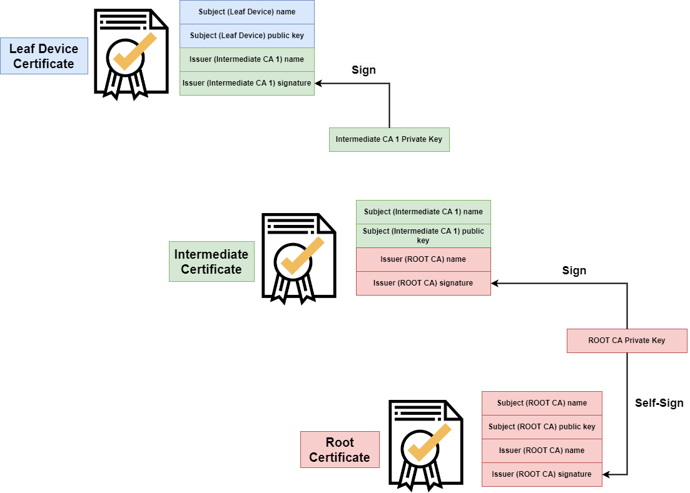

# Provisioning Flows

## Standard Provisioning - DMS

DMS stands for **Device Manufacturing System** and stands at the core of Lamassu. It is the central piece that tides CAs with your devices in an **automatized** and **standardized** manner.

Instead of having to create your own integrations between Lamassu and your devices, a DMS provides a set of endpoints that should be invoked by a device.

### Enrollment Protocols

The enrollment protocol defines witch endpoints

#### EST - RFC7030

### Authentication Modes

#### MTLS
##### Chain Validation level
In the MTLS connection, when performing the Enroll process, the client can send the certificate chain. The certificate chain is a sequence of certificates that starts with the client certificate and goes all the way to the root certificate authority. Each certificate in the chain is signed by the previous one, and this process continues until the root certificate is reached. In this case, the root certificate is stored in Lamassu.

<figure markdown="1">

</figure>

In order to perform the verification of the certificates in the chain, the variable `chain_validation_level` has been added in the creation of the DMS to indicate up to which level the verification is to be performed.
    
- `chain_validation_level`: `-1` **- All certificates in the chain are verified.**
- `chain_validation_level`: `1` **- The certificate is verified up to level 1 of the chain.**
- `chain_validation_level`: `2` **- Certificates are verified up to level 2 of the chain.**
- `chain_validation_level`: `n` **- Certificates are verified up to level N of the chain.**

#### PSK
#### JWT
#### NoAuth

### PreRegistration

#### JITP
#### Pre Registered - Simple (Infinite Window)
#### Pre Registered - Manual Enabled Window (timed)

### Cloud Integrations

## Custom Provisioning