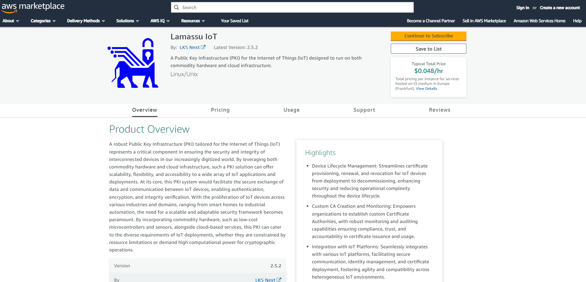

# Welcome to Lamassu Iot Docs

Lamassu is an IoT first PKI designed for industrial scenarios. Public key
infrastructure are systems in charge of creating, storing and distributing
digital certificates which are used to verify that a particular public key
belongs to a certain entity. PKIs creates digital certificates which map to
public keys to entities, securely stores these certificates in a central
repository and revokes them if needed.

## AWS Marketplace

Lamassu is out now in the AWS Marketplace. This is an AMI-based product that only charges with the actual costs of the underlying EC2. Streamline the installation process using the AMI! [Check it out](https://aws.amazon.com/marketplace/pp/prodview-fyfailowg3ewc)

