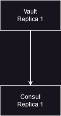
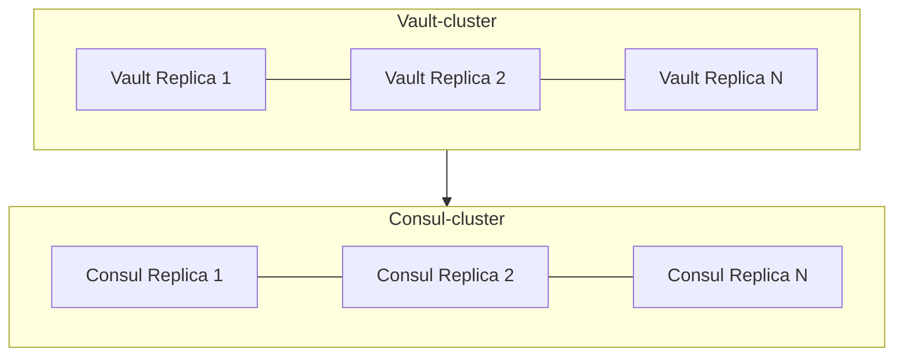

Vault can be deployed in two different modes depending on your availability requirements. Thus Vault (together with Consul) can be deployed as Standalone Applications or in a High Availability Cluster. Select one deployment mode and follow the installation instructions.

Define the following ENV variable as it will be referenced in both installation modes to specify on witch kubernetes namespace the applications shall be installed:

```bash
export NS=dev-lamassu
```

### Installation Modes
#### Standalone



1. The first step is to deploy Consul as it will be used by Vault to store the PKI sensitive data. In order to make that possible, you have to use the `oss-helm-values/consul-ha.yaml` 

```bash
helm install consul -n $NS hashicorp/consul -f oss-helm-values/consul.yaml 
```

2. Once Consul is installed, Install Vault running the following command:

```bash
helm install vault -n $NS hashicorp/vault -f oss-helm-values/vault.yaml 
```

3. After finishing the installation of the two services, the next step is to initialise vault.
#### High Availability

This section covers vault installation using high availability deployment architecture (by default the values file launches 3 replica for Consul and for Vault, but can be fine tuned to deploy as many replicas as needed).



1. Launch consul in HA mode: 

```bash
helm install consul -n $NS hashicorp/consul -f oss-helm-values/consul-ha.yaml 
```

2. Once Consul is installed, Install Vault in HA running the following command:

```bash
helm install vault -n $NS hashicorp/vault -f oss-helm-values/vault-ha.yaml 
```

3. After finishing the installation of the two services, the next step is to initialise vault.
### Initialising Vault

By default Vault has no data which means it is in an uninitialised status.  Vault´s initialisation process consist on creating the main encryption keys used to prtotect data at rest. In order to automatise the initialised process, first open a shell and run this command to enable temporal external connectivity with vault so the initialisation process can  be carried out.

```bash
VAULT_SVC_NAME=vault
kubectl port-forward -n $NS svc/$VAULT_SVC_NAME 8200:8200 --address 0.0.0.0
```

The script below, will take care of initializing vault by, creating the unseal keys and unsealing vault, as well as creating the AppRole accounts used by Lamassu to access this service with the required permissions:

```bash
{
export VAULT_SVC_NAME=127.0.0.1

isVaultInitialized=$(curl -s -k http://$VAULT_SVC_NAME:8200/v1/sys/init | jq -r .initialized)
if [ "$isVaultInitialized" == "true" ]; then
  echo ">> Vault already initialized. Exiting init process"
else
	echo ">> Vault is healthy but requires init"
	echo ">> Initializing vault"
	credsFile="vault-credentials.json"
	curl -s --request POST --data '{"secret_shares": 5,"secret_threshold": 3}' -k http://$VAULT_SVC_NAME:8200/v1/sys/init > $credsFile
	echo "  - Unseal keys and root token sotred in '$credsFile'"
fi

for ip in $(kubectl get endpoints vault -n $NS -o json | jq -r ".subsets[].addresses[].ip"); do
  echo '{"key": '$(cat vault-credentials.json | jq .keys[0])'}'  > payload.json
  curl     --request POST     --data @payload.json  http://$ip:8200/v1/sys/unseal

  echo '{"key": '$(cat vault-credentials.json | jq .keys[1])'}'  > payload.json
  curl     --request POST     --data @payload.json  http://$ip:8200/v1/sys/unseal

  echo '{"key": '$(cat vault-credentials.json | jq .keys[2])'}'  > payload.json
  curl     --request POST     --data @payload.json  http://$ip:8200/v1/sys/unseal

done

export VAULT_TOKEN=$(cat vault-credentials.json | jq .root_token)
export SECRET_ENGINE=lamassu
export POLICY_NAME=lms
export ROLE_NAME=lms

VAULT_TOKEN=$(echo $VAULT_TOKEN | sed 's/"//g')

curl --header "X-Vault-Token: $VAULT_TOKEN" --request POST  --data '{"type": "approle"}' "http://$VAULT_SVC_NAME:8200/v1/sys/auth/approle"

curl --header "X-Vault-Token: $VAULT_TOKEN" --request PUT --data '{"policy":"# Read-only permission on secrets stored at 'secret/data/mysql/webapp'\npath \"'$SECRET_ENGINE'/*\" {\n  capabilities = [ \"read\", \"create\" ]\n}  path \"sys/mounts/'$SECRET_ENGINE'\" {\n  capabilities = [ \"read\", \"create\", \"update\" ]\n}  path \"sys/mounts\" {\n capabilities = [ \"read\" ]\n}"}' http://$VAULT_SVC_NAME:8200/v1/sys/policies/acl/$POLICY_NAME

curl --header "X-Vault-Token: ${VAULT_TOKEN}" --data '{"policies": "'$POLICY_NAME'"}'  "http://$VAULT_SVC_NAME:8200/v1/auth/approle/role/$ROLE_NAME"

CA_VAULT_ROLEID=$(curl --header "X-Vault-Token: $VAULT_TOKEN" http://$VAULT_SVC_NAME:8200/v1/auth/approle/role/$ROLE_NAME/role-id | jq -r .data.role_id | sed 's/\\n/\n/g' | sed -Ez '$ s/\n+$//')
CA_VAULT_SECRETID=$(curl --header "X-Vault-Token: $VAULT_TOKEN" --request POST http://$VAULT_SVC_NAME:8200/v1/auth/approle/role/$ROLE_NAME/secret-id | jq -r .data.secret_id | sed 's/\\n/\n/g' | sed -Ez '$ s/\n+$//')

echo ROLE_ID
echo $CA_VAULT_ROLEID

echo secret_id
echo $CA_VAULT_SECRETID
}
```

```bash

ROLE_ID
YjMyOTI4MjctNmQ1My00Y2JlLWJkYWQtMWVlYTgxYWQ2MWY3
secret_id
OWEwM2JkOTItOTNiMy02ZDJiLTVkZWMtMzFhYTM5Njc1YTE3
```


