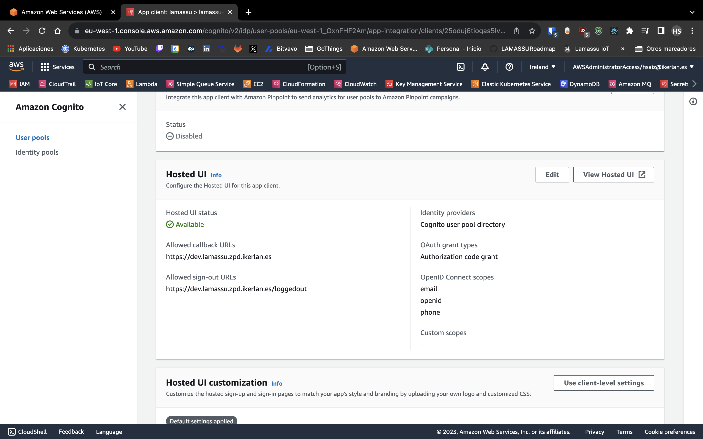

# AWS Cognito

This guide will walk you through configuring AWS Cognito to be your OIDC provider for managing your users instead of the OSS alternative provided, Keycloak.

## AWS Console Setup

The first step is to create a user pool to manage the users of the Lamassu. As can be seen in the image, in this case the user pool has the name lamassu-oidc. 


After you have created the user pool, the next step is to start creating the users who will be authorized to use Lamassu. In the photo, you can see that in this case, the user pool has three users associated. In order to use Cognito, you need to create some users.


In the next photo, you can see the Cognito domain. The link is used for the process of signing in and signing up the users in order to authorize them to use the Lamassu. You need to copy it into your application to interact with Cognito.


For instance you can configure Cognito to use the following [Image (click to open)](imgs/hosted-ui-logo.jpeg) as the main logo displayed when a user is redirected to sign in.

To instruct Cognito to display the main logo, use the following css:

```css
.logo-customizable {
  max-width: 100%;
  max-height: 100%;
}

.banner-customizable {
  padding: 10px 0px 10px 0px;
  background-color: #007ACC;
}

.submitButton-customizable {
  font-size: 14px;
  font-weight: bold;
  margin: 20px 0px 10px 0px;
  height: 40px;
  width: 100%;
  color: #fff;
  background-color: #007ACC;
}

.submitButton-customizable:hover {
  color: #fff;
  background-color: gray;
}

```

The css code you need to copy in the Hosted UI customization part. Also, you need to upload the logo image.


You need to indicate which is the URL of the UI and also the URL of the logout with the aim of allowing the callbacks. This is done in order to improve the security of the Cognito. In the image, you can see how are defined the variables `allowed callback URLs` and `allowed sign-out URLs`.



## Lamassu Helm Chart values config

You need to configure Lamassu helm chart with the following yaml. In the code, you need to change the AWS region and the user pool id with your Cognito values.

```yaml
services:
  keycloack:
    enabled: false
auth:
  oidc:
    frontend:
      authority: https://cognito-idp.<COGNIT_AWS_REGION>.amazonaws.com/<COGNITO_USER_POOL_ID>
      clientId: lamassu
      awsCognito:
        enabled: true
        hostedUiDomain: "<COGNITO_HOSTED_UI>"
  apiGateway:
    jwksUrl: https://cognito-idp.<COGNIT_AWS_REGION>.amazonaws.com/<COGNITO_USER_POOL_ID>/.well-known/jwks.json
  authorization:
    rolesClaim: "cognito:groups"
    roles:
      admin: pki-admin
      operator: pki-operator
```